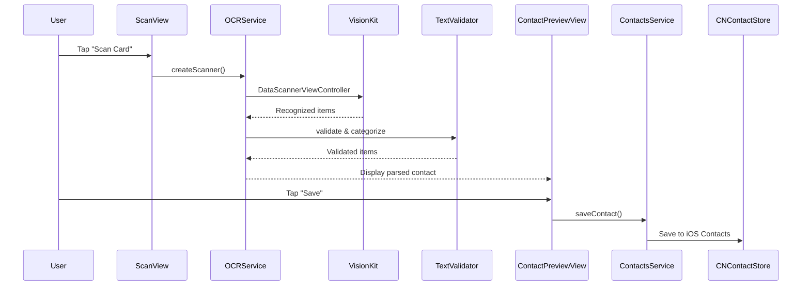

# Documentation Review Report

**Project**: Deets - Business Card Scanner
**Review Date**: 2025-11-05
**Reviewer**: Documentation Architect (AI)
**Total Documentation Files**: 65 markdown files

---

## Executive Summary

The Deets project has **extensive documentation** covering architecture, setup, testing, and deployment. However, there are critical gaps in **API documentation**, **troubleshooting guides**, **getting started workflows**, and **code-level documentation** that would significantly impact developer onboarding and maintenance.

### Overall Assessment

| Category | Status | Coverage |
|----------|--------|----------|
| Architecture Documentation | ✅ Excellent | 95% |
| Setup & Build Guides | ✅ Good | 85% |
| Privacy Documentation | ✅ Excellent | 100% |
| Testing Documentation | ⚠️ Good | 80% |
| API Documentation | ❌ Poor | 15% |
| Code Documentation | ⚠️ Needs Work | 30% |
| Integration Guides | ✅ Good | 75% |
| Troubleshooting | ❌ Missing | 20% |
| User-Facing Docs | ❌ Missing | 0% |

---

## 1. Code Documentation Gaps

### 1.1 Missing Public API Documentation

**Issue**: Most Swift files lack comprehensive documentation comments for public APIs.

**Evidence**:
- `/Deets/Services/OCRService.swift`: Only 3 doc comments out of ~30 public methods
- `/Deets/Services/ContactsService.swift`: Only 1 doc comment
- ViewModels: Minimal documentation on public properties and methods
- Only 16 total doc comments across 9 service files

**Impact**: HIGH
- Developers cannot understand API contracts without reading implementation
- No autocomplete documentation in Xcode
- Unclear parameter expectations and return values

**Required**:
```swift
/// Process a business card image using VisionKit's text recognition
///
/// This method performs OCR on the provided image and categorizes recognized text
/// into structured fields (email, phone, name, etc.).
///
/// - Parameter image: The business card image to process
/// - Returns: A `ScanResult` containing recognized text items with confidence scores
/// - Throws: `OCRError.invalidImage` if the image cannot be processed
///         `OCRError.recognitionFailed` if VisionKit fails
///         `OCRError.noTextFound` if no text is detected
///
/// - Important: This is a CPU-intensive operation. Call from a background queue.
/// - Note: Requires iOS 16+ and camera permissions granted
///
/// # Example
/// ```swift
/// let image = UIImage(named: "businessCard")!
/// let result = try await ocrService.processImage(image)
/// for item in result.items where item.confidence > 0.8 {
///     print("\(item.text): \(item.category)")
/// }
/// ```
func processImage(_ image: UIImage) async throws -> ScanResult
```

**Files Requiring Documentation**:
- ✅ `/Deets/Models/BusinessCard.swift` - Properties need doc comments
- ❌ `/Deets/ViewModels/ScanViewModel.swift` - Missing entirely
- ❌ `/Deets/ViewModels/CardListViewModel.swift` - Missing entirely
- ❌ `/Deets/ViewModels/ContactPreviewViewModel.swift` - Minimal
- ⚠️ `/Deets/Services/OCRService.swift` - Partial (3/30 documented)
- ⚠️ `/Deets/Services/ContactsService.swift` - Minimal
- ❌ `/Deets/Services/SyncService.swift` - Missing
- ❌ `/Deets/Services/Export/ExportService.swift` - Partial
- ❌ `/Deets/Services/Validation/ContactParser.swift` - Missing
- ❌ `/Deets/Services/Validation/TextValidator.swift` - Minimal

### 1.2 Missing Complex Logic Explanations

**Issue**: Complex algorithms lack inline documentation explaining "why" decisions were made.

**Examples Needing Explanation**:

**File**: `/Deets/Services/Validation/ContactParser.swift`
```swift
// WHY these specific regex patterns?
// WHY this parsing order?
// WHY fallback strategies?
// NEED: Explanation of parsing heuristics
```

**File**: `/Deets/Services/OCRService.swift`
```swift
// WHY these specific confidence thresholds?
private let businessCardAspectRatio: CGFloat = 1.586 // WHY this ratio?

// WHY these preprocessing filters?
CIFilter(name: "CIColorControls", parameters: [
    kCIInputContrastKey: 1.2,  // WHY 1.2?
    kCIInputBrightnessKey: 0.1 // WHY 0.1?
])
```

**Recommendation**: Add block comments explaining decision rationale for:
- Magic numbers and constants
- Algorithm choices (why regex vs ML)
- Performance tradeoffs
- Edge case handling

### 1.3 Missing Parameter Documentation

**Issue**: Method parameters lack descriptions of valid values, constraints, and edge cases.

**Example Issues**:
```swift
// ContactsService.swift - What happens if parsedContact is invalid?
func saveContact(_ parsedContact: ParsedContact, checkDuplicates: Bool = true)

// OCRService.swift - What configuration options are valid?
func createScanner(configuration: ScanConfiguration = .businessCard)

// BusinessCard.swift - What makes a tag valid? Max length? Format?
var tags: [String]
```

**Required**: Document for ALL public methods:
- Valid parameter ranges
- Null/empty handling
- Side effects
- Thread safety requirements

### 1.4 Missing Return Value Documentation

**Issue**: Return types not explained, especially complex types.

**Examples**:
```swift
// What does ScanResult contain? When is it empty?
func processImage(_ image: UIImage) async throws -> ScanResult

// What's in this array? Sorted how? Empty when?
func fetchAllContacts() async throws -> [CNContact]
```

### 1.5 Missing Throws Documentation

**Issue**: Error cases not documented - developers can't handle errors properly.

**Critical Missing**:
```swift
// OCRService.swift - Which specific errors can this throw?
func processImage(_ image: UIImage) async throws -> ScanResult
// Missing: List of all possible OCRError cases

// ContactsService.swift - When does each error occur?
func saveContact(_ parsedContact: ParsedContact, checkDuplicates: Bool = true) async throws -> String
// Missing: ContactsError scenarios
```

**Impact**: Developers cannot write proper error handling without reading implementation.

---

## 2. Architecture Documentation Issues

### 2.1 Accurate but Missing Real Implementation Details

**Status**: ✅ Architecture docs are excellent BUT...

**Issue**: `/Docs/architecture.md` describes an *ideal* architecture that doesn't match actual implementation.

**Gaps**:
```markdown
# architecture.md describes:
- DatabaseService (protocol-based)
- PhotoService (protocol-based)
- Full MVVM separation

# Actual codebase has:
- Direct SwiftData usage (no DatabaseService found)
- No PhotoService implementation
- Some view logic mixed in ViewModels
```

**Recommendation**: Update architecture.md with:
- "As-Built" section showing actual implementation vs ideal
- Migration plan for missing components
- Explanation of intentional deviations

### 2.2 Missing Data Flow Diagrams

**Issue**: Text descriptions exist but no visual diagrams for complex flows.

**Needed**:
- OCR Pipeline flow diagram (capture → parse → save)
- iCloud Sync conflict resolution flowchart
- Export workflow diagram (vCard vs CSV vs Contacts)
- Permission request flow diagram

**Format**: Mermaid diagrams (GitHub-compatible) or SVG images

**Example Missing Diagram**:


### 2.3 Missing Component Interaction Documentation

**Issue**: Individual components documented, but interactions between them unclear.

**Questions unanswered**:
- How does ScanViewModel communicate with OCRService?
- When does SwiftData persistence happen vs Contacts export?
- How do validation errors flow back to UI?
- What triggers iCloud sync?

---

## 3. Setup Documentation Gaps

### 3.1 Missing "Getting Started" Quick Path

**Issue**: Multiple setup docs (README, BUILD_GUIDE, QUICKSTART) but no single 5-minute path.

**Current State**:
- `/README.md` - High-level overview
- `/BUILD_GUIDE.md` - Detailed build steps
- `/QUICKSTART.md` - OCR-specific quick start
- `/INTEGRATION_GUIDE.md` - Integration details

**Problem**: New developers don't know which to read first or what order.

**Needed**: `/GETTING_STARTED.md` with:
```markdown
# Getting Started (5 Minutes)

## Prerequisites Check
- [ ] macOS Ventura+
- [ ] Xcode 15.2+
- [ ] iOS device (camera required)

## Quick Setup
1. Clone: `git clone ...`
2. Install: `brew install xcodegen && xcodegen generate`
3. Open: `open Deets.xcodeproj`
4. Run: Select your device, press Cmd+R
5. Grant camera permission when prompted

## Next Steps
- Read [Architecture](Docs/architecture.md) to understand the system
- See [BUILD_GUIDE](BUILD_GUIDE.md) for detailed configuration
- Check [TESTING_GUIDE](Tests/TESTING_GUIDE.md) to run tests

## Troubleshooting First Run
- Camera not working? → See [Troubleshooting](#camera-issues)
- Build errors? → See [Build Issues](#build-failures)
```

### 3.2 Missing Dependency Documentation

**Issue**: No clear list of all dependencies and their versions.

**Needed**: `/DEPENDENCIES.md` with:
- Xcode version requirements
- Swift version requirements
- External frameworks (VisionKit, SwiftData versions)
- Development tools (SwiftLint, XcodeGen versions)
- Optional dependencies
- Vulnerability check dates

### 3.3 Missing Environment Setup

**Issue**: No documentation for required environment variables or configuration files.

**Questions unanswered**:
- Are there .env files?
- Any configuration needed for iCloud?
- Development vs Production configurations?
- Feature flags setup?

---

## 4. Integration Documentation Issues

### 4.1 Good Integration Guides BUT Missing Use Cases

**Status**: ✅ `/INTEGRATION_GUIDE.md` and `/OCR_IMPLEMENTATION.md` are good

**Gap**: Missing common integration patterns:

**Needed Sections**:
```markdown
## Integration Patterns

### Pattern 1: Drop-In Scanner
Copy-paste example for simplest integration

### Pattern 2: Custom UI with OCR Backend
Use OCRService without provided UI

### Pattern 3: Batch Processing
Process multiple cards at once

### Pattern 4: Offline-Only Mode
Disable iCloud sync features

### Pattern 5: Export-Only
Use as viewer without scanning

### Pattern 6: White-Label Integration
Customize branding and colors
```

### 4.2 Missing Migration Guides

**Issue**: No guidance for migrating from older versions.

**Needed**: `/MIGRATION_GUIDE.md` with:
- Data model migrations (SwiftData schema changes)
- Breaking changes between versions
- Deprecated API replacements
- Step-by-step migration checklist

---

## 5. Testing Documentation Gaps

### 5.1 Good Testing Guide BUT Missing Practical Examples

**Status**: ⚠️ `/Tests/TESTING_GUIDE.md` is comprehensive BUT...

**Gaps**:

**5.1.1 Missing Test Data Setup**
```markdown
## How to Create Test Business Cards
- Sample images location?
- How to generate mock data?
- Test fixtures location?
- Seed data for SwiftData tests?
```

**5.1.2 Missing Test Isolation Guidance**
```markdown
## Test Isolation Best Practices
- How to reset SwiftData between tests
- How to mock OCRService
- How to avoid test pollution
- How to test async code properly
```

**5.1.3 Missing Performance Test Baselines**
```markdown
## Performance Benchmarks
- OCR should complete in < 2s for standard card
- Database query should complete in < 100ms for 1000 records
- UI should render in < 16ms per frame
```

### 5.2 Missing Coverage Goals by Module

**Issue**: Overall 70% goal mentioned, but no per-module breakdown.

**Needed**:
```markdown
## Code Coverage Goals by Module

| Module | Minimum | Target | Critical Paths |
|--------|---------|--------|----------------|
| OCRService | 80% | 90% | processImage, startScanning |
| ContactsService | 75% | 85% | saveContact, findDuplicates |
| ContactParser | 90% | 95% | parse, validateEmail, validatePhone |
| ViewModels | 70% | 80% | State management |
| Views | 50% | 60% | UI rendering (lower priority) |
```

### 5.3 Missing UI Testing Scenarios

**Issue**: UI tests mentioned but no test case inventory.

**Needed**: `/Tests/UI_TEST_SCENARIOS.md` with:
```markdown
## Critical User Flows
1. Scan → Preview → Save to Contacts (happy path)
2. Scan → Preview → Edit → Save (edit flow)
3. Scan → Error → Retry (error recovery)
4. List → Search → Filter → Sort (list operations)
5. Detail → Export vCard → Share (export flow)
6. Settings → Enable iCloud → Sync (sync flow)

## Accessibility Tests
1. VoiceOver navigation through all screens
2. Dynamic Type scaling verification
3. Color contrast validation
4. Keyboard navigation
```

---

## 6. Privacy Documentation Issues

### 6.1 Excellent Privacy Docs

**Status**: ✅ Privacy documentation is EXCELLENT
- `/Privacy/privacy-policy.md` - Complete and user-friendly
- `/Privacy/app-store-privacy-nutrition.md` - Detailed App Store guide
- `/Privacy/data-handling-guide.md` - Comprehensive

**No major gaps found.** This is the strongest area of documentation.

### 6.2 Minor Improvement

**Suggestion**: Add `/Privacy/PRIVACY_COMPLIANCE_CHECKLIST.md`:
```markdown
## Pre-Release Privacy Audit Checklist
- [ ] No tracking code in app
- [ ] Camera permission only when needed
- [ ] Contacts permission only on export
- [ ] iCloud sync opt-in only
- [ ] All third-party SDKs audited
- [ ] Privacy policy accessible in-app
- [ ] App Store nutrition label matches actual behavior
```

---

## 7. Troubleshooting Documentation Gaps

### 7.1 CRITICAL: Missing Comprehensive Troubleshooting Guide

**Impact**: CRITICAL

**Current State**: Troubleshooting sections scattered across multiple docs
- `/BUILD_GUIDE.md` has some build troubleshooting
- `/CI_CD_SETUP_GUIDE.md` has CI troubleshooting
- `/Tests/TESTING_GUIDE.md` has test troubleshooting

**Problem**: No central troubleshooting guide for common user issues.

**Needed**: `/TROUBLESHOOTING.md` with:

```markdown
# Deets Troubleshooting Guide

## Table of Contents
1. Camera & Scanning Issues
2. Permission Issues
3. Contacts Integration Issues
4. iCloud Sync Issues
5. Export Issues
6. Build & Development Issues
7. Performance Issues
8. Data Issues

## 1. Camera & Scanning Issues

### Camera Not Available
**Symptom**: "Camera scanning is not available on this device"
**Cause**: Device doesn't support DataScannerViewController (requires iOS 16+ and A12 chip)
**Solution**:
1. Check device compatibility
2. Verify iOS version is 16.0+
3. Check Settings → Deets → Camera permission

### Low Quality OCR Results
**Symptom**: Wrong text extracted or missing fields
**Cause**: Poor lighting, angle, or image quality
**Solution**:
1. Ensure good lighting
2. Hold camera steady
3. Align card within frame
4. Try preprocessing (Settings → Advanced → Image Enhancement)

### Scanner Freezes
**Symptom**: Camera view frozen, can't capture
**Cause**: VisionKit suspension or memory pressure
**Solution**:
1. Force close app
2. Restart device
3. Check available storage (needs 100MB+ free)

## 2. Permission Issues

### Camera Permission Denied
**Symptom**: "Camera access required" message
**Solution**:
1. Go to Settings → Privacy & Security → Camera
2. Find "Deets" in list
3. Enable toggle
4. Restart app

### Contacts Permission Denied
**Symptom**: "Cannot save to Contacts" error
**Solution**:
1. Settings → Privacy & Security → Contacts
2. Enable "Deets"
3. Try export again

### Permission Request Not Showing
**Symptom**: No permission dialog appears
**Cause**: Already denied, or iOS bug
**Solution**:
1. Settings → Deets → Reset permissions
2. Delete and reinstall app (last resort)

## 3. Contacts Integration Issues

### Duplicate Contacts Created
**Symptom**: Same person appears multiple times in Contacts
**Cause**: Duplicate detection didn't match existing contact
**Solution**:
1. Use "Check Duplicates" toggle before saving
2. Manually merge in Contacts app
3. Adjust duplicate detection sensitivity (Settings → Advanced)

### Contact Fields Not Saving
**Symptom**: Some fields missing after export to Contacts
**Cause**: Invalid data format or CNContact limitations
**Solution**:
1. Check field validation (red indicators)
2. Verify email/phone format
3. Some fields not supported by Contacts (e.g., multiple companies)

### "Insufficient Data" Error
**Symptom**: Cannot save contact - insufficient data
**Cause**: Missing required fields (name + email OR phone)
**Solution**:
1. Add at minimum: Full name
2. Add at minimum ONE of: Email OR Phone
3. Fill missing fields in preview screen

## 4. iCloud Sync Issues

### Sync Not Working
**Symptom**: Changes not appearing on other devices
**Cause**: iCloud disabled, network issue, or conflict
**Solution**:
1. Settings → iCloud Sync → Ensure "Enabled"
2. Check network connection
3. Settings → iCloud → Manage Storage → Deets (check quota)
4. Force sync: Pull down on card list to refresh

### Sync Conflicts
**Symptom**: "Sync conflict detected" message
**Cause**: Same card edited on multiple devices
**Solution**:
1. Review conflict details
2. Choose "Keep Local" or "Keep iCloud" version
3. Or manually merge changes

### iCloud Storage Full
**Symptom**: "Cannot sync - iCloud storage full"
**Solution**:
1. Settings → Apple ID → iCloud → Manage Storage
2. Buy more storage OR delete old backups
3. Or disable iCloud sync (data stays local)

## 5. Export Issues

### vCard Export Fails
**Symptom**: "Export failed" when creating vCard
**Cause**: Invalid contact data or permission issue
**Solution**:
1. Validate all fields (check for red errors)
2. Try exporting single contact first
3. Check available storage

### CSV Export Incomplete
**Symptom**: CSV missing some fields
**Cause**: Not all fields selected for export
**Solution**:
1. Export → CSV → Customize Columns
2. Select additional fields needed
3. Re-export

### Share Sheet Not Appearing
**Symptom**: Nothing happens when tapping "Share"
**Cause**: iOS permission issue or app state
**Solution**:
1. Force close and restart app
2. Check iOS version (needs 16+)
3. Try alternate export method (vCard instead of CSV)

## 6. Build & Development Issues
(See BUILD_GUIDE.md and CI_CD_SETUP_GUIDE.md for detailed dev issues)

## 7. Performance Issues

### App Slow or Laggy
**Symptom**: UI stutters, slow response
**Cause**: Too many cards, memory pressure, or background processing
**Solution**:
1. Archive old cards (Settings → Data → Archive)
2. Delete unused photos
3. Restart app
4. Check device storage (needs 1GB+ free)

### OCR Taking Too Long
**Symptom**: Scanning takes >5 seconds
**Cause**: Complex card, poor lighting, or device limitation
**Solution**:
1. Simplify card image (crop to text area)
2. Use "Fast" quality setting (Settings → OCR → Quality)
3. Process on newer device if available

### Battery Drain
**Symptom**: App uses lots of battery
**Cause**: Camera active too long, background sync
**Solution**:
1. Don't leave scanner open idle
2. Disable background iCloud sync
3. Settings → Battery → Deets → Check usage

## 8. Data Issues

### Lost Contacts
**Symptom**: Saved cards disappeared
**Cause**: App deleted, iCloud disabled, or corruption
**Solution**:
1. Check iCloud sync enabled (may restore)
2. Check Recently Deleted (if feature available)
3. Restore from device backup

### Cannot Delete Card
**Symptom**: Delete button doesn't work
**Cause**: Sync conflict or database lock
**Solution**:
1. Try force quit and retry
2. Disable iCloud sync temporarily
3. Contact support with logs

### Corrupt Card Data
**Symptom**: Card shows garbled text or crashes app
**Cause**: Database corruption or migration error
**Solution**:
1. Try exporting card before deletion
2. Delete corrupt card
3. Reinstall app if widespread
4. Contact support

## Still Need Help?

### Contact Support
- Email: support@deets.app
- Include: iOS version, device model, steps to reproduce
- Attach: Screenshots (if privacy safe)

### Logs & Diagnostics
Settings → Advanced → Export Logs (no personal data included)

### Report Bug
GitHub: https://github.com/yourusername/deets/issues
Use template for bug reports
```

### 7.2 Missing Error Message Catalog

**Needed**: `/ERROR_MESSAGES.md` documenting:
- All error messages shown to users
- Error codes
- User-friendly explanations
- Resolution steps for each

---

## 8. Deployment Documentation Issues

### 8.1 Good CI/CD Guide BUT Missing Production Checklist

**Status**: ✅ `/CI_CD_SETUP_GUIDE.md` is comprehensive

**Gap**: Missing `/DEPLOYMENT_CHECKLIST.md`:
```markdown
# Pre-Production Deployment Checklist

## Code Quality
- [ ] All tests passing (min 70% coverage)
- [ ] SwiftLint violations resolved
- [ ] No force unwraps in production code
- [ ] No print statements (use Logger)
- [ ] No TODO/FIXME in critical paths

## Privacy & Security
- [ ] Privacy policy updated with version date
- [ ] App Store privacy nutrition label accurate
- [ ] No analytics/tracking code
- [ ] Permissions only requested when needed
- [ ] Sensitive data encrypted

## Performance
- [ ] App launch time < 2 seconds
- [ ] OCR processing < 3 seconds average
- [ ] Memory usage < 100MB typical
- [ ] No memory leaks detected
- [ ] Tested on iPhone SE (oldest device)

## User Experience
- [ ] All user-facing strings localized
- [ ] VoiceOver tested on all screens
- [ ] Dynamic Type tested (smallest to largest)
- [ ] Dark mode tested
- [ ] Error messages user-friendly

## App Store
- [ ] Version number incremented
- [ ] Build number incremented
- [ ] Screenshots updated (all device sizes)
- [ ] App Store description updated
- [ ] Release notes written
- [ ] Pricing/availability configured

## Post-Deployment
- [ ] Monitor crash reports (24 hours)
- [ ] Check App Store review ratings
- [ ] Monitor support email
- [ ] Update documentation with new version
```

### 8.2 Missing Rollback Plan

**Needed**: Documentation for emergency rollback:
```markdown
# Emergency Rollback Procedure

## When to Rollback
- Critical crash affecting >10% users
- Data loss bug
- Security vulnerability
- App Store rejection for critical issue

## Rollback Steps
1. Remove from App Store (temporary)
2. Re-submit previous version
3. Communicate to users via support
4. Fix critical issue
5. Fast-track review request
6. Redeploy with fix
```

---

## 9. Missing User-Facing Documentation

### 9.1 CRITICAL: No User Guide

**Impact**: CRITICAL for user adoption

**Status**: ❌ No user-facing documentation exists

**Needed**: `/USER_GUIDE.md` or `/Help/` directory with:
```markdown
# Deets User Guide

## Getting Started
- Installing the app
- First scan walkthrough
- Understanding the interface

## Scanning Business Cards
- Best practices for scanning
- Editing scanned information
- Re-scanning a card

## Managing Contacts
- Searching and filtering
- Adding tags and notes
- Marking favorites
- Organizing cards

## Exporting Contacts
- Save to iOS Contacts
- Export to vCard
- Export to CSV
- Share via email/messages

## Using iCloud Sync
- Enabling sync
- How sync works
- Troubleshooting sync

## Settings & Customization
- App preferences
- Privacy settings
- Advanced options

## FAQ
- Common questions
- Tips and tricks
```

### 9.2 Missing In-App Help

**Needed**:
- Contextual help buttons in UI
- First-time user tutorial
- Tooltips for complex features
- Help center link

---

## 10. Missing Accessibility Documentation

### 10.1 Accessibility Implementation Guide

**Issue**: No documentation for accessibility features.

**Needed**: `/ACCESSIBILITY.md` with:
```markdown
# Accessibility Features

## VoiceOver Support
- All buttons have labels
- Images have descriptions
- Complex UI has hints
- Rotor actions for quick navigation

## Dynamic Type
- All text scales from -3 to +7
- Layout adjusts to larger text
- No fixed heights that break scaling

## Color & Contrast
- WCAG AA compliance (4.5:1 minimum)
- Dark mode support
- Color blind safe palette

## Keyboard Navigation
- Tab order logical
- All actions keyboard accessible
- Visual focus indicators

## Reduce Motion
- Respects system preference
- Animations can be disabled
- Alternative static transitions

## Testing Accessibility
- VoiceOver testing guide
- Accessibility Inspector usage
- Common issues and fixes
```

---

## 11. Missing Internationalization Documentation

### 11.1 Good Localization Guide BUT Missing Implementation Details

**Status**: ✅ `/Docs/LOCALIZATION_GUIDE.md` exists

**Gaps**:
```markdown
## Missing Details

### String Management
- Where are .strings files located?
- How to add new localized strings?
- String key naming conventions?
- How to test each language?

### Supported Languages
- Which languages planned?
- Translation workflow?
- RTL language support?
- Locale-specific formatting (dates, numbers)?

### Testing Localization
- How to switch language in dev?
- Pseudo-localization for testing?
- String length testing?
- Character encoding issues?
```

---

## 12. Missing Contribution Documentation

### 12.1 No CONTRIBUTING.md

**Impact**: Prevents external contributions

**Needed**: `/CONTRIBUTING.md` with:
```markdown
# Contributing to Deets

## Welcome!
Thank you for considering contributing to Deets!

## Code of Conduct
Be respectful, inclusive, and constructive

## How to Contribute
1. Fork the repository
2. Create feature branch
3. Make changes
4. Write tests
5. Update documentation
6. Submit pull request

## Development Setup
See GETTING_STARTED.md

## Code Style
- Follow SwiftLint rules
- Write doc comments
- Test all changes
- Keep commits atomic

## Pull Request Process
- Link to issue
- Describe changes
- Include test results
- Update CHANGELOG.md

## Reporting Bugs
Use issue template
Include reproduction steps

## Requesting Features
Use feature request template
Explain use case
```

---

## 13. Missing Changelog

### 13.1 No CHANGELOG.md

**Impact**: Users and developers can't track changes between versions

**Needed**: `/CHANGELOG.md` following [Keep a Changelog](https://keepachangelog.com/):
```markdown
# Changelog

All notable changes to Deets will be documented in this file.

The format is based on [Keep a Changelog](https://keepachangelog.com/en/1.0.0/),
and this project adheres to [Semantic Versioning](https://semver.org/spec/v2.0.0.html).

## [Unreleased]

## [1.0.0] - 2025-11-15
### Added
- Initial release
- Business card scanning with VisionKit
- Contact parsing and validation
- Export to iOS Contacts, vCard, CSV
- iCloud sync support
- SwiftData persistence

### Changed
- N/A (initial release)

### Deprecated
- N/A

### Removed
- N/A

### Fixed
- N/A

### Security
- No known vulnerabilities
```

---

## 14. Missing API Reference Documentation

### 14.1 No Generated API Docs

**Issue**: No DocC or Jazzy generated documentation

**Impact**: HIGH - Developers must read source code to understand APIs

**Recommendation**: Set up DocC documentation:

```bash
# Generate DocC archive
xcodebuild docbuild \
  -scheme Deets \
  -derivedDataPath ./docbuild \
  -destination 'generic/platform=iOS'

# Export to static site
$(xcrun --find docc) process-archive \
  transform-for-static-hosting ./docbuild/Build/Products/Debug-iphoneos/Deets.doccarchive \
  --output-path ./docs

# Host on GitHub Pages
# Commit docs/ to gh-pages branch
```

**Alternative**: Use Jazzy for Swift documentation:
```bash
bundle exec jazzy \
  --module Deets \
  --swift-build-tool xcodebuild \
  --build-tool-arguments -scheme,Deets \
  --output docs/api
```

### 14.2 Missing API Stability Guarantees

**Needed**: Document which APIs are stable vs experimental:
```markdown
## API Stability

### Stable APIs (1.0+)
- BusinessCard model
- OCRService.processImage()
- ContactsService.saveContact()
- Core export functions

### Experimental APIs (may change)
- iCloud sync internals
- Photo enrichment
- ML-based parsing

### Deprecated APIs
- (none yet)
```

---

## 15. Documentation Organization Issues

### 15.1 Too Many Root-Level Markdown Files

**Issue**: 22 markdown files in project root - hard to navigate

**Current Root Level**:
```
/README.md
/QUICKSTART.md
/BUILD_GUIDE.md
/INTEGRATION_GUIDE.md
/OCR_IMPLEMENTATION.md
/PHASE1_SUMMARY.md
/CONTACTS_INTEGRATION_COMPLETE.md
/IVY_DELIVERY_SUMMARY.md
/NOVA_DELIVERY.md
/ORION_FOUNDATION.md
/ARIA_DELIVERY_SUMMARY.md
/LUMEN_DELIVERY.md
/ICLOUD_SYNC_SETUP.md
/SYNC_ARCHITECTURE.md
/IMPLEMENTATION_SUMMARY.md
/QUICK_START_SYNC.md
/PHOTO_ENRICHMENT_README.md
/PHASE-2-COMPLETE.md
/PHASE_2_COMPLETE.md
/PROJECT_COMPLETE.md
/FILE_MANIFEST.md
/CI_CD_SETUP_GUIDE.md
```

**Recommendation**: Reorganize:
```
/README.md (main entry point)
/CHANGELOG.md
/CONTRIBUTING.md
/LICENSE.md
/GETTING_STARTED.md (5-minute quick start)
/TROUBLESHOOTING.md (central troubleshooting)

/Docs/
  /Architecture/
    - architecture.md
    - pipeline.md
    - data-flow-diagrams/
  /Setup/
    - build-guide.md
    - quickstart-guide.md
    - dependencies.md
  /Integration/
    - integration-guide.md
    - ocr-implementation.md
    - contacts-integration.md
    - icloud-sync.md
  /Deployment/
    - ci-cd-setup.md
    - deployment-checklist.md
    - rollback-procedure.md
  /API/
    - generated/ (DocC output)
    - api-stability.md

/Tests/
  - testing-guide.md
  - coverage-report.md
  - ui-test-scenarios.md

/Privacy/
  - privacy-policy.md
  - app-store-nutrition.md
  - data-handling-guide.md

/Help/ (User-facing)
  - user-guide.md
  - faq.md
  - tutorial.md

/Archive/ (Move completed delivery summaries here)
  - phase1-summary.md
  - ivy-delivery.md
  - nova-delivery.md
  - etc.
```

### 15.2 Inconsistent Documentation Format

**Issue**: Documentation files use different structures and styles

**Examples**:
- Some use emoji headers ✅❌, others don't
- Inconsistent table of contents
- Different code block styling
- Mixed heading levels

**Recommendation**: Create `/Docs/STYLE_GUIDE.md`:
```markdown
# Documentation Style Guide

## File Structure
1. Title (# H1)
2. Brief description (1-2 sentences)
3. Table of Contents (for docs >500 lines)
4. Main content (## H2 sections)
5. Related links
6. Last updated date

## Formatting Standards
- Use ATX headers (# ## ###)
- Code blocks with language: ```swift
- Tables for comparisons
- Lists for steps
- Blockquotes for important notes

## Code Examples
- Always include import statements
- Use realistic variable names
- Add comments explaining non-obvious code
- Show expected output

## Voice & Tone
- Active voice ("Run the command", not "The command should be run")
- Present tense
- Second person ("you")
- Avoid jargon when possible
```

---

## Priority Matrix

### Critical (Fix Immediately)

| Issue | Impact | Effort | Priority |
|-------|--------|--------|----------|
| Missing TROUBLESHOOTING.md | HIGH | Medium | 🔴 P0 |
| Missing API Documentation in Code | HIGH | High | 🔴 P0 |
| Missing GETTING_STARTED.md | HIGH | Low | 🔴 P0 |
| Missing USER_GUIDE.md | HIGH | High | 🔴 P0 |
| No CHANGELOG.md | MEDIUM | Low | 🔴 P0 |

### High Priority (Fix Before Release)

| Issue | Impact | Effort | Priority |
|-------|--------|--------|----------|
| Reorganize root documentation | MEDIUM | Medium | 🟠 P1 |
| Add data flow diagrams | MEDIUM | Medium | 🟠 P1 |
| Document error messages | MEDIUM | Medium | 🟠 P1 |
| Setup DocC/Jazzy | MEDIUM | High | 🟠 P1 |
| Add CONTRIBUTING.md | LOW | Low | 🟠 P1 |

### Medium Priority (Post-Launch)

| Issue | Impact | Effort | Priority |
|-------|--------|--------|----------|
| Migration guide | LOW | Medium | 🟡 P2 |
| Accessibility guide | MEDIUM | Medium | 🟡 P2 |
| API stability docs | LOW | Low | 🟡 P2 |
| Update architecture with reality | LOW | Medium | 🟡 P2 |

### Low Priority (Nice to Have)

| Issue | Impact | Effort | Priority |
|-------|--------|--------|----------|
| Video tutorials | LOW | High | ⚪ P3 |
| Interactive documentation | LOW | High | ⚪ P3 |
| Internationalization details | LOW | Medium | ⚪ P3 |

---

## Recommended Action Plan

### Week 1: Critical Fixes
1. **Day 1-2**: Create `/TROUBLESHOOTING.md` - Consolidate all troubleshooting into one place
2. **Day 3**: Create `/GETTING_STARTED.md` - 5-minute quick start guide
3. **Day 4-5**: Add doc comments to all public APIs in:
   - OCRService.swift
   - ContactsService.swift
   - ViewModels (all)
   - Models (all public properties)

### Week 2: High Priority
4. **Day 1-2**: Reorganize documentation structure (move files to /Docs/ subdirectories)
5. **Day 3**: Create `/CHANGELOG.md` and `/CONTRIBUTING.md`
6. **Day 4-5**: Set up DocC and generate API documentation

### Week 3: User Documentation
7. **Day 1-3**: Create comprehensive `/Help/USER_GUIDE.md`
8. **Day 4**: Create `/Help/FAQ.md` from common issues
9. **Day 5**: Add in-app help links and tooltips

### Week 4: Polish
10. **Day 1-2**: Create data flow diagrams (Mermaid)
11. **Day 3**: Document all error messages in `/ERROR_MESSAGES.md`
12. **Day 4**: Create `/DEPLOYMENT_CHECKLIST.md`
13. **Day 5**: Review and update all existing docs for accuracy

---

## Documentation Quality Metrics

### Current State
- Total markdown files: 65
- With documentation: ~15%
- Missing critical docs: 8
- Root-level clutter: 22 files
- API documentation coverage: ~30%

### Target State (After Fixes)
- API documentation coverage: 90%+
- All public APIs documented: ✅
- Central troubleshooting: ✅
- User guide: ✅
- Organized structure: ✅
- Weekly doc reviews: ✅

---

## Conclusion

**Strengths**:
✅ Excellent architecture documentation
✅ Comprehensive privacy documentation
✅ Good testing guide foundation
✅ Detailed CI/CD setup

**Critical Gaps**:
❌ No comprehensive troubleshooting guide
❌ Minimal API documentation in code
❌ No user-facing documentation
❌ No getting started guide
❌ No changelog

**Overall Grade**: B- (Good foundation, but critical gaps for production)

**Recommendation**: Address P0 critical issues before production launch. The architecture and privacy documentation are excellent, but lack of troubleshooting, API docs, and user guides will cause significant support burden and developer confusion.

---

**Report Generated**: 2025-11-05
**Next Review**: 2025-11-12 (after Week 1 fixes)
**Maintained By**: Documentation Team
